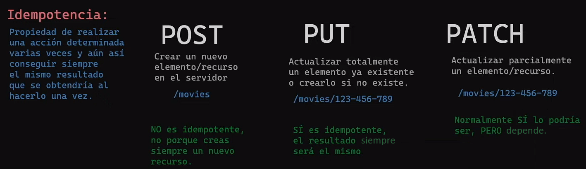

# learn-nodejs
En este repositorio se verán los conceptos de NodeJS desde cero, crear páginas dinámicas, crear paginas estáticas, asignar rutas, modelos y squemas con bases de datos como MySQL y MongoDB Atlas + mongoose 

## Pruebalo
Si encuentras oportunidades de mejora o identificas problemas, estaría agradecido si pudieras abrir issues en el repositorio. Tu experiencia y comentarios serían de gran ayuda para mejorar el proyecto. ¡Gracias de antemano!" 👍
```bash
pnpm i
pnpm run start
```
## src
Cursos midudev: https://www.youtube.com/watch?v=yB4n_K7dZV8&list=PLUofhDIg_38qm2oPOV-IRTTEKyrVBBaU7  
Cursos bluuweb lista de reproduccion: https://www.youtube.com/watch?v=mG4U9t5nWG8&list=PLPl81lqbj-4IEnmCXEJeEXPepr8gWtsl6

## Apuntes

En CommandJS no hace falta poner extensión al utilizarlo:
"const {sum} = require('./sum.mjs')"
Mietras que en EMAScript si es necesario poner la extensión:
"import {sum, sub, mult} from './sum.mjs'

Actualmente es mas recomendable y mas utilizado mjs, utilizan el sistema de módulos ES6 (ECMAScript) nativo
Siempre hay que priorizar que sean asíncronas o promesas antes que síncronas.
Diferencias de síncrona, asíncrona con callbaks, asíncrona secuencial, y asíncrona paralela.


La diferencia entre parámetros y argumentos: los parámetros son las variables
definidas en la declaración de la función, mientras que los argumentos son los
valores que se proporcionan cuando se llama a la función y que se asignan a los
parámetros para su uso interno dentro de la función.

El primer comando que devemos utilizar en cualquier pryecto de node es npm init, nos creará
un nuevo archivo package.json, desde donde podremos gestiionar las versiones de las dependencias,
y al añadir una nueva dependencia nos generara un archivo package-lock.json
Podremos instalar dependencias con "npm i dependencia" o "npm install dependencia".
Podremos desinstalar dependencias con "npm rm dependencia" o "npm rm dependencia" o "npm rm dependencia".

Hay dos tipos de dependencias: las "dependencias de producción", las que nuestra aplicacción la
necesita para funcionar en el entorno final, por ejemplo "npm i picocolors"
El otro tipo son las "dependencias de desarollo", estas son las dependencias que son necesarias durante el
desarrollo y no son esenciales para que la aplicación funcione en producción.
"npm i dependencia -D" o "npm i dependencia --development" indica que es de desarollo.

## Status code;
Existe una página web que explíca todos los errores de una manera divertida con imágenes de gatos,
https://http.cat

Un buffer: En nodejs es una clase global que se utiliza para trabajar con datos binarios,
lo guarda en un espacio de la memoria física.

### POST - PUT - PATCH

