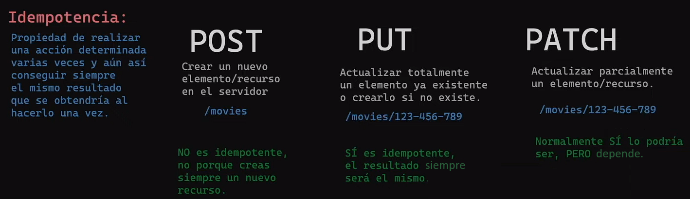

# learn-nodejs
En este repositorio veremos los conceptos de nodejs desde cero.  Utilizando como el curso en Youtube de midulive

En CommandJS no hace falta poner extension al utilizar:
"const {sum} = require('./sum.mjs')"
Mietras que en EMAScript si es necesario poner la extension:
"import {sum, sub, mult} from './sum.mjs'

Actualmente es mas recomendable y mas utilizado mjs.
Trabajo: Ver en la documentacion cuales tienen y cuales no tienen promesas.
Siempre hay que priorizar que sean asicronas o promesas antes que syncronas.
Diferencias de sincrona, asincrona con callbaks, asincrona secuencial, y asincrona paralela.

La diferencia entre parámetros y argumentos: los parámetros son las variables
definidas en la declaración de la función, mientras que los argumentos son los
valores que se proporcionan cuando se llama a la función y que se asignan a los
parámetros para su uso interno dentro de la función.

El primer comando que devemos utilizar en cualquier pryecto de node es npm init, nos creará
un nuevo archivo package.json, desde donde podremos gestiionar las versiones de las dependencias,
y al añadir una nueva dependencia nos generara un archivo package-lock.json
Podremos instalar dependencias con "npm i dependencia"
Podremos desinstalar dependencias con "npm un dependencia"

Hay dos tipos de dependencias, las "dependencias de producción", nuestra aoplicacción la
necesita para funcionar, por ejemplo "npm i picocolors"
la otra es "dependencias de desarollo", para instalarla devemos por
ejemplo "npm i standard -D" la -D o --development indica que es de desarollo.

Status code;
Existe una pagina web que expllica todos los errores de una manera duivertida con gatos,
https://http.cat

Un buffer, en nodejs es una clase global que la utilizan para trabajar con datos binarios,
Lo guarda en un espacio de la memoria fisica.

POST -PUT - PATCH

