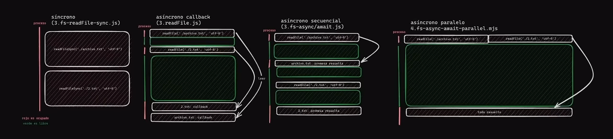

# learn-nodejs
En este repositorio será utilizado para ver los conceptos de nodejs desde cero.  utilizando como el curso en Youtube de midulive
Diferencias de sincrona-asincrona con callbaks - asincronas secuenciales - y asincronas paralelas.

